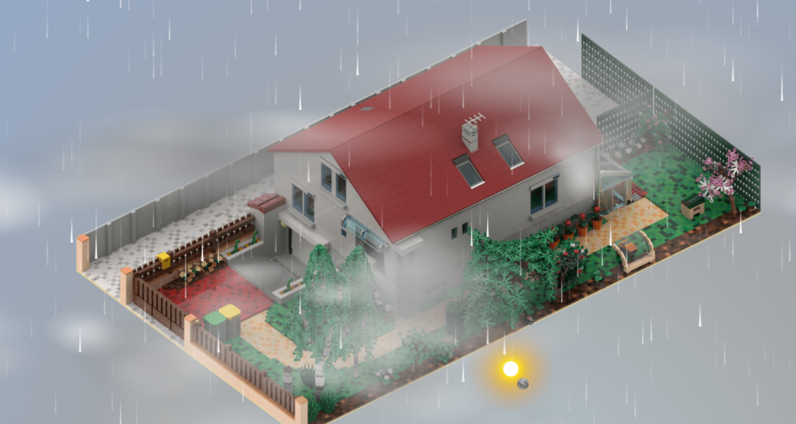

# 🌤️ MeteoCSS Card

[](https://github.com/hacs/integration)
[](https://github.com/Pulpyyyy/meteocss-card/releases)
[](https://opensource.org/licenses/MIT)

A stunning and realistic weather card for Home Assistant featuring dynamic sky, sun, moon, and immersive weather effects.



https://github.com/user-attachments/assets/07463969-425f-423e-a758-a8abea28b8b6


## ✨ Features

- 🌞 **Realistic Sun** : Azimuth/elevation position tracking with aura and halo
- 🌙 **Detailed Moon** : Complete lunar phases with 3D texture
- ☁️ **Animated Clouds** : Multiple coverage levels with real-time distortion, based on speed wind
- 🌧️ **Weather Effects** : Rain, snow, fog with smooth animations
- ⚡ **Extreme Conditions** : Realistic lightning for storms
- 🌅 **Adaptive Gradients** : Sky changes with conditions and time
- 🌟 **Twinkling Stars** : Night display with shooting stars
- 🎛️ **Demo Mode** : Time simulator with weather conditions
- 🎨 **Fully Customizable** : Colors, radii, orbits, angles

## 📋 Requirements

- Home Assistant with **weather** integration enabled
- **Sun integration** : Built-in to Home Assistant (provides `sun.sun` entity)
- **Luna integration** : Install from [okkine/HA-Luna](https://github.com/okkine/HA-Luna)
  - Provides lunar azimuth, elevation, and phase data
  - Required for accurate moon positioning and phases

### Installing Required Integrations

#### 👉 Sun Integration (Native - No Installation Needed)
The sun integration is built-in to Home Assistant. Just ensure it's enabled:

```yaml
# configuration.yaml
sun:
```

#### 👉 Luna Integration (Custom Integration) https://github.com/okkine/HA-Luna

1. Install via HACS:
   - Open HACS → **Integrations**
   - Search for "Luna"
   - Install "HA-Luna" by okkine
   - Restart Home Assistant

2. Configure using UI

3. Verify entities are created:
   - `sensor.luna_lunar_azimuth`
   - `sensor.luna_lunar_elevation`
   - `sensor.luna_lunar_phase`
   - `sensor.luna_lunar_phase_degrees`

## 🚀 Installation

### Via HACS (recommended)

[](https://my.home-assistant.io/redirect/hacs_repository/?owner=Pulpyyyy&repository=meteocss-card&category=plugin)

or

1. Open HACS → **Frontend**
2. Click on **⋮** → **Custom repositories**
3. Add: `https://github.com/Pulpyyyy/meteocss-card`
4. Select type  **Dashboard**
5. Click on `Add`
6. Now searh for **MeteoCSS Card**
7. Install and restart Home Assistant

### Manual Installation

1. Create `www/meteo-card/` folder in your config directory
2. Download `meteocss-card.js` into this folder
3. Add to `ui-lovelace.yaml` :
```yaml
resources:
  - url: /local/meteo-card/meteocss-card.js
    type: module
```

## 📝 Configuration

### Basic demo configuration

```yaml
type: custom:meteo-card
weather: weather.home
sun_entity: sun.sun
demo_mode: true
```

### Minimal Configuration

```yaml
type: custom:meteo-card
weather: weather.home
sun_entity: sun.sun
```

### Picture-elements example

```yaml
type: picture-elements
image: /local/empty.png
elements:
  - type: custom:meteo-card
    demo_mode: false
    weather: weather.home
    layers:
      - sky
      - background
    style:
      top: 50%
      left: 50%
      width: 100%
      height: 100%
  - type: image
    image: /local/base.png
    entity: weather.home
    style:
      top: 50%
      left: 50%
      width: 100%
  - type: custom:meteo-card
    demo_mode: false
    weather: weather.home
    layers:
      - moon
      - sun
      - foreground
    style:
      top: 50%
      left: 50%
      width: 100%
      height: 100%
```

### Complete YAML and default values configuration Example

```yaml
type: custom:meteo-card

# Entity References
weather: weather.home                                         # Weather entity
sun_entity: sun.sun                                            # Sun position entity
moon_azimuth_entity: sensor.luna_lunar_azimuth                 # Moon azimuth (optional)
moon_elevation_entity: sensor.luna_lunar_elevation             # Moon elevation (optional)
moon_phase_entity: sensor.luna_lunar_phase                     # Moon phase (optional)
moon_degrees_entity: sensor.luna_lunar_phase_degrees           # Moon phase rotation angle (optional)

# Orbit Configuration (percentage of container)
orbit:
  rx: 45      # Horizontal radius (controls the width of the elliptical path)
  ry: 40      # Vertical radius (controls the height of the elliptical path)
  cx: 50      # Horizontal center (offsets the entire orbit left or right, 50 = middle)
  cy: 50      # Vertical center (offsets the entire orbit up or down, 50 = middle)
  tilt: 0     # Orbit tilt/rotation in degrees (e.g., 15 for a diagonal path)

# House Orientation
house_angle: 25           # Angle offset for your location (degrees, 0-360)
invert_azimuth: false     # Invert azimuth direction if needed

# Sun Configuration
sun:
  disc_radius: 8          # Size of sun disc (SVG units)
  halo_radius: 50         # Inner halo radius
  aura_radius: 130        # Outer aura radius
  aura_opacity: 0.15      # Aura transparency (0-1)
  halo_opacity: 0.4       # Halo transparency (0-1)
  zoom: 1.0               # Scale multiplier
  colors:
    aura: '#FFCC00'       # Outer glow color
    halo: '#FFFFFF'       # Middle halo color
    disc: '#FFFFFF'       # Center disc color
  lens_flare:
    enabled: true         # Enable/disable lens flare effect
    halo_radius: 120      # Large outer halo radius
    halo_stroke_width: 2  # Stroke thickness
    halo_opacity: 0.3     # Halo transparency (0-1)
    inner_halo_radius: 50 # Inner halo radius
    inner_halo_stroke_width: 1  # Inner stroke thickness
    inner_halo_opacity: 0.2     # Inner halo transparency
    glow_stdDeviation: 3  # Blur intensity (higher = more blur)
    flares:               # Array of lens flare reflections
      - distance: 80      # Distance from sun center
        radius: 18        # Circle radius
        color: '#FFFFFF'  # Reflection color
        opacity: 0.25     # Reflection transparency
      - distance: 130
        radius: 12
        color: '#FFAAFF'
        opacity: 0.15
      - distance: 160
        radius: 8
        color: '#AAFFFF'
        opacity: 0.1

# Moon Configuration
moon:
  disc_radius: 8          # Moon size
  halo_radius: 35         # Inner halo
  aura_radius: 80         # Outer aura
  aura_opacity: 0.1       # Aura transparency
  halo_opacity: 0.2       # Halo transparency
  zoom: 1.0               # Scale multiplier
  colors:
    aura: '#FFFFFF'       # Outer glow
    disc_light: '#FDFDFD' # Bright side of moon
    disc_dark: '#9595A5'  # Dark side of moon

# Sky Colors (as radial-gradient : https://gradients.app/en/newradial )
colors:
  night:
    clear: '#25259C 0%, #2A2A60 40%, #0F0344 100%'     # Clear night gradient
    normal: '#272762 0%, #302C2C 100%'                  # Regular night
    dark: '#0E0E54 0%, #000000 100%'                    # Dark night (storms)
  day:
    normal: '#FFFFFF 0%, #4BA0DB 50%, #004390 100%'    # Clear day
    inter: '#B9DFFF 0%, #B0C4C8 60%, #7A9BA0 100%'     # Intermediate
    rainy: '#B9DFFF 0%, #C1CBD0 60%, #91A6B0 100%'     # Rainy day
    dark: '#B9DFFF 0%, #2F4F4F 60%, #708090 100%'      # Dark day
    snowy: '#B0E2FF 0%, #AAAAAA 60%, #D3D3D3 100%'     # Snowy day
    grey: '#B4C4CB 0%, #A4A6A8 60%, #94A9C7 100%'      # Overcast
  sunrise: '#FFF5C3 0%, #FFD966 10%, #FFA64D 30%, #FF7F50 50%, #5D0000 80%, #002340 100%'
  sunset: '#FEFEFFCC 0%, #ECFF00 10%, #FD3229 25%, #F30000 45%, #5D0000 75%, #001A33 100%'

# Cloud Configuration [count, puffs, gradation]
clouds:
  heavy: [15, 5, 4]      # Heavy cloudiness
  normal: [10, 3, 2]     # Regular clouds
  low: [4, 2, 1]         # Few clouds
  minimal: [2, 2, 0]     # Minimal clouds
  none: [0, 0, 0]        # Clear sky
  animation:             # Cloud animation settings
    min_margin: 5        # Minimum margin from top (%)
    max_margin: 85       # Maximum margin from top (%)
    random_variation: 0.3 # Random position variation factor

# Rain Configuration
rain_intensity:
  width: 1       # Drop size
  heavy: 200     # Downpour during storms
  normal: 100    # Regular rain
  low: 50        # Very light rain

# Snow Configuration
snow_intensity:
  normal: 80

# Fog Configuration
fog:
  opacity_min: 0.15      # Minimum fog opacity (0-1)
  opacity_max: 0.85      # Maximum fog opacity (0-1)
  blur: 15               # Blur effect strength (px)
  height: 180            # Fog layer height (px)

# Render Layers (order matters for z-index)
layers:
  - sky
  - sun
  - moon
  - background
  - foreground

# Demo Mode (simulator without real entities)
demo_mode: false
```

## Lens Flare Configuration Examples

### Disable lens flare globally
```yaml
sun:
  lens_flare:
    enabled: false
```

### Customize lens flare appearance
```yaml
sun:
  lens_flare:
    enabled: true
    halo_radius: 150          # Larger outer halo
    glow_stdDeviation: 5      # More blur
    flares:
      - distance: 100
        radius: 20
        color: '#FF0000'      # Red reflection
        opacity: 0.3
      - distance: 150
        radius: 15
        color: '#00FF00'      # Green reflection
        opacity: 0.2
```

### Cloud Animation Customization

```yaml
clouds:
  animation:
    min_margin: 10      # Start clouds further down
    max_margin: 90      # Extend higher
    random_variation: 0.5 # More variation in positions
```

### Fog Effect Customization

```yaml
fog:
  opacity_min: 0.25     # Brighter fog at minimum
  opacity_max: 0.95     # Denser fog at maximum
  blur: 20              # More blur for softer effect
  height: 200           # Taller fog layers
```

### Advanced Custom Colors Example

```yaml
type: custom:meteo-card
weather: weather.home
sun_entity: sun.sun
house_angle: 45

# Custom vibrant colors
colors:
  day:
    normal: '#87CEEB 0%, #E0F6FF 100%'  # Sky blue
    rainy: '#708090 0%, #2F4F4F 100%'   # Slate gray
  night:
    clear: '#0B1E5C 0%, #000000 100%'   # Deep navy

# Custom sun
sun:
  disc_radius: 10
  aura_radius: 150
  colors:
    disc: '#FFD700'
    aura: '#FFA500'
    halo: '#FFFACD'

# Custom moon
moon:
  disc_radius: 9
  colors:
    disc_light: '#F0F0F0'
    disc_dark: '#808080'
```

## 🎮 Supported Weather Conditions and mixing pattern

| Icon | Condition | Clouds | Sky | Rain (Drops) | Snow (Flakes) | Lightning |
|------|-----------|--------|-----|--------------|---------------|-----------|
| ☀️ | `sunny` | minimal | normal | clear | — | — |
| ⛅ | `partlycloudy` | low | normal | — | — | — |
| ☁️ | `cloudy` | heavy | grey | normal | — | — |
| 💧 | `rainy` | normal | rainy | normal | low | — |
| 🌧️ | `pouring` | heavy | dark | dark | normal | — |
| ⛈️ | `lightning-rainy` | heavy | dark | dark | heavy | Yes |
| ❄️ | `snowy` | normal | snowy | normal | normal | — |
| 🌫️ | `fog` | none | grey | normal | — | — |
| 🌙 | `clear-night` | none | — | clear | — | — |
| — | `default` | low | normal | normal | — | — |

## 🧪 Demo Mode

Enable demo mode to test without real entities:

```yaml
type: custom:meteo-card
demo_mode: true
```

**Demo Controls:**
- **Dropdown** : Select a weather condition to preview
- **Play/Pause Button** : Control time simulation
- **Info Panel** : Shows current time, sun/moon positions, phase, altitude, azimuth

Demo automatically cycles through all weather conditions every 60 seconds.

## 🎨 Customization Tips

### keep it simple !

You only need to replace the values you want to modify.  
For a given category (for example, the Moon), there is no need to redefine everything—only include the fields you want to change.

Example:
```yaml
moon:
  disc_radius: 8  # Moon size
```

### Fine-tune Sun Glow (moon is similar)

```yaml
sun:
  disc_radius: 8
  halo_radius: 50    # Increase for wider glow
  aura_radius: 130   # Extend outer radiance
  halo_opacity: 0.6  # Brighten halo (0-1)
  aura_opacity: 0.2  # Brighten aura
```

### Adjust Cloud Density and Position

```yaml
clouds:
  heavy: [20, 8, 5]  # More clouds, more detail
  normal: [8, 2, 1]  # Less clouds overall
  animation:
    min_margin: 15   # Clouds start lower
    max_margin: 75   # Clouds stop higher
```

### Custom Orbit

```yaml
orbit:
  rx: 50  # Wider horizontal movement
  ry: 45  # Taller vertical range
```

### Location-Specific Orientation

```yaml
house_angle: 0    # North facing
house_angle: 90   # East facing
house_angle: 180  # South facing
house_angle: 270  # West facing
```

## 📊 Home Assistant Entity Examples

### Using Luna Integration (HA-Luna)

1. Install Luna integration via HACS
2. Add to configuration.yaml:
   ```yaml
   # configuration.yaml
   luna:
   ```
3. After restart, verify these entities exist:
   - `sensor.luna_lunar_azimuth`
   - `sensor.luna_lunar_elevation`
   - `sensor.luna_lunar_phase`
   - `sensor.luna_lunar_phase_degrees`

4. Reference in card:
   ```yaml
   type: custom:meteo-card
   weather: weather.home
   sun_entity: sun.sun
   moon_azimuth_entity: sensor.luna_lunar_azimuth
   moon_elevation_entity: sensor.luna_lunar_elevation
   moon_phase_entity: sensor.luna_lunar_phase
   moon_degrees_entity: sensor.luna_lunar_phase_degrees
   ```

### Using OpenWeatherMap

```yaml
# configuration.yaml
weather:
  - platform: openweathermap
    api_key: !secret openweather_api_key
    name: home_weather
```

Then reference:
```yaml
type: custom:meteo-card
weather: weather.home_weather
sun_entity: sun.sun
```

## 🐛 Troubleshooting

### Entities not found
- Verify sun integration is enabled (add `sun:` to configuration.yaml)
- Install Luna integration from [okkine/HA-Luna](https://github.com/okkine/HA-Luna)
- Check entity names in Developer Tools → States
- After Luna installation, verify these entities appear:
  - `sensor.luna_lunar_azimuth`
  - `sensor.luna_lunar_elevation`
  - `sensor.luna_lunar_phase`
  - `sensor.luna_lunar_phase_degrees`

### Sun/Moon not displaying
- Confirm elevation is valid (sun shows only when elevation ≥ 0°)
- Check moon entities are correct
- Verify azimuth values are 0-360°

### Animations are stuttering
- Reduce number of rain/snow particles
- Decrease cloud count
- Check browser performance (F12 → Performance)

### Colors look wrong
- Use valid hex color format (#RRGGBB)
- Verify gradient syntax: '#color 0%, #color 100%'
- Test with demo mode first

### Demo mode not working
- Ensure demo_mode: true is set
- Refresh page (Ctrl+Shift+R)
- Check browser console for errors

### Clouds appearing in wrong position
- Adjust `clouds.animation.min_margin` and `max_margin`
- Check `random_variation` value (0-1)

### Fog too visible/invisible
- Adjust `fog.opacity_min` and `fog.opacity_max`
- Increase/decrease `fog.blur` for harder/softer edges
- Change `fog.height` for thicker/thinner layers

## 📜 License

MIT License - See LICENSE file for details

## 🤝 Contributing

Contributions are welcome! Feel free to:
- Report bugs
- Suggest improvements
- Submit pull requests
- Share custom configurations

## ⭐ Support

If you like this card, please consider giving it a ⭐ on GitHub!

---

**Made with ❤️ for the Home Assistant community**
