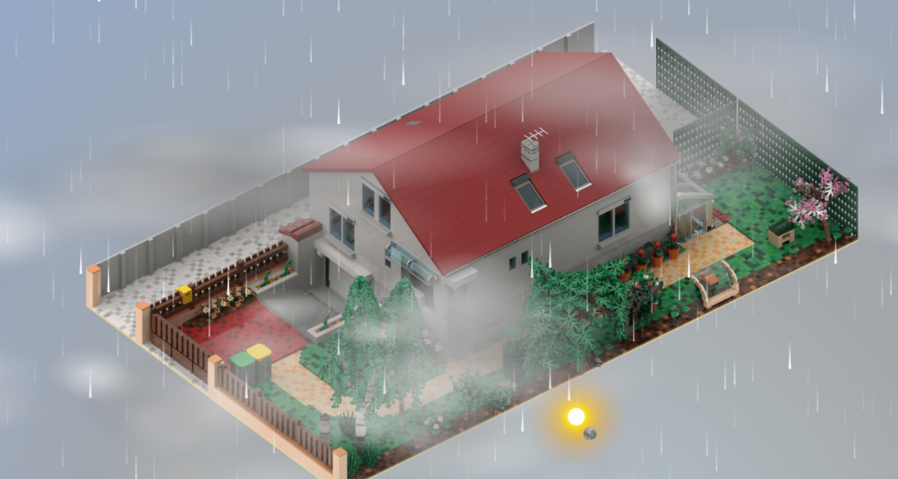

# 🌤️ MeteoCSS Card

[](https://github.com/hacs/integration)
[](https://github.com/Pulpyyyy/meteocss-card/releases)
[](https://opensource.org/licenses/MIT)

A stunning and realistic weather card for Home Assistant featuring dynamic sky, sun, moon, and immersive weather effects.



https://github.com/user-attachments/assets/07463969-425f-423e-a758-a8abea28b8b6


## ✨ Features

- 🌞 **Realistic Sun** : Azimuth/elevation position tracking with aura and halo
- 🌙 **Detailed Moon** : Complete lunar phases with 3D texture
- ☁️ **Animated Clouds** : Multiple coverage levels with real-time distortion, based on wind speed
- 🌧️ **Weather Effects** : Rain, snow, fog with smooth animations
- ⚡ **Extreme Conditions** : Realistic lightning for storms
- 🌅 **Adaptive Gradients** : Sky changes with conditions and time
- 🌟 **Twinkling Stars** : Night display with shooting stars
- 🎛️ **Demo Mode** : Time simulator with weather conditions
- 🎨 **Fully Customizable** : Colors, radii, orbits, angles
- 🔄 **Multi-Card Sync** : Automatic synchronization of multiple cards on the same screen
- 🌒 **Dynamic Shadows** : Real-time WebGL shadow rendering driven by sun/moon position using a depth map

## 📋 Requirements

- Home Assistant with **weather** integration enabled
- **Sun integration** : Built-in to Home Assistant (provides `sun.sun` entity)
- **Luna integration** : Install from [okkine/HA-Luna](https://github.com/okkine/HA-Luna)
  - Provides lunar azimuth, elevation, and phase data
  - Required for accurate moon positioning and phases

### Installing Required Integrations

#### 👉 Sun Integration (Native - No Installation Needed)
The sun integration is built-in to Home Assistant. Just ensure it's enabled:

```yaml
# configuration.yaml
sun:
```

#### 👉 Luna Integration (Custom Integration) https://github.com/okkine/HA-Luna

1. Install via HACS:
   - Open HACS → **Integrations**
   - Search for "Luna"
   - Install "HA-Luna" by okkine
   - Restart Home Assistant

2. Configure using UI

3. Verify entities are created:
   - `sensor.luna_lunar_azimuth`
   - `sensor.luna_lunar_elevation`
   - `sensor.luna_lunar_phase`
   - `sensor.luna_lunar_phase_degrees`

## 🚀 Installation

### Via HACS (recommended)

[](https://my.home-assistant.io/redirect/hacs_repository/?owner=Pulpyyyy&repository=meteocss-card&category=plugin)

or

1. Open HACS → **Frontend**
2. Click on **⋮** → **Custom repositories**
3. Add: `https://github.com/Pulpyyyy/meteocss-card`
4. Select type **Dashboard**
5. Click on `Add`
6. Now search for **MeteoCSS Card**
7. Install and restart Home Assistant

### Manual Installation

1. Create `www/meteo-card/` folder in your config directory
2. Download `meteocss-card.js` into this folder
3. Add to `ui-lovelace.yaml`:
```yaml
resources:
  - url: /local/meteo-card/meteocss-card.js
    type: module
```

## 📝 Configuration

### 🔄 Multi-Card Synchronization (Singleton System)

The singleton system allows multiple MeteoCSS cards on the same screen to share the same data and animations, creating a cohesive and optimized visual experience.

#### How It Works

**Core Concept**: A shared singleton object (stored in global memory in `MeteoSingletons`) acts as a "single source of truth" for all cards with the same ID. This guarantees that if you have three cards on a screen, the sun, moon, and rain are perfectly synchronized.

**Master/Slave Election**:
- One card per singleton group is elected as "Master"
- The Master performs all heavy calculations (sun/moon positions, transitions, weather effects)
- Other cards (Slaves) simply listen and reflect the Master's data
- This **saves browser resources** and ensures perfect synchronization

**Creation and Initialization**:
1. Each card receives a `singleton_id` (default: auto-generated unique ID)
2. When the first card with this ID loads, the singleton is created
3. Subsequent cards with the same ID attach to the existing singleton
4. Master election happens automatically

**Shared Data**:
- Sun position (azimuth, elevation)
- Moon position (azimuth, elevation, phase, phase degrees)
- Current weather condition
- Wind speed
- Demo state (running, paused, stopped)
- Simulated time (demo mode only)
- Cloud counts (background and foreground)

#### Cloud Distribution System

The cloud distribution system uses a **background ratio** to intelligently split clouds between background and foreground layers, creating depth and visual layering.

**How Cloud Ratio Works**:

Each weather condition has a `background_ratio` value (0.0 to 1.0) that determines the proportion of clouds rendered in the background layer:

- `background_ratio: 0.9` → 90% of clouds in background, 10% in foreground
- `background_ratio: 0.5` → 50% of clouds in background, 50% in foreground
- `background_ratio: 0.3` → 30% of clouds in background, 70% in foreground

**Practical Example**:

For `cloudy` condition with `clouds: heavy` (15 total clouds) and `background_ratio: 0.6`:
- Background clouds: 15 × 0.6 = 9 clouds
- Foreground clouds: 15 × 0.4 = 6 clouds

Result: Denser cloud coverage in the back, fewer clouds in front for a more dynamic, layered look.

**Default Ratios by Condition**:

| Condition | Background Ratio | Purpose |
|-----------|------------------|---------|
| `sunny` | 0.9 | Minimal clouds mostly in background |
| `partlycloudy` | 0.8 | Few clouds mostly in background |
| `cloudy` | 0.6 | Balanced cloud distribution |
| `rainy` | 0.7 | More background clouds for depth |
| `pouring` | 0.3 | Heavy foreground clouds (more dramatic) |
| `lightning-rainy` | 0.3 | Heavy foreground for storm effect |
| `snowy` | 0.5 | Even distribution |
| `fog` | 0.3 | Fog in foreground, minimal background |
| `clear-night` | 0.5 | Minimal clouds, balanced if any |

**Custom Cloud Ratios**:

You can customize the background ratio for any condition:

```yaml
type: custom:meteo-card
weather: weather.home
sun_entity: sun.sun
conditions:
  cloudy:
    clouds: heavy
    background_ratio: 0.4  # More dramatic foreground clouds
    day_sky: grey
    night_sky: normal
```

**Singleton Data Tracking**:

The singleton stores:
- `bgCloudCount` : Number of clouds rendered in background layer
- `fgCloudCount` : Number of clouds rendered in foreground layer

These are displayed in the demo UI info panel for debugging and validation.

#### Practical Usage

**To synchronize cards**: use the same `singleton_id`

```yaml
# Card 1 - Background layers
type: custom:meteo-card
weather: weather.home
sun_entity: sun.sun
singleton_id: "main_sync"
layers:
  - sky
  - background

---

# Card 2 - Foreground layers (same ID for sync)
type: custom:meteo-card
weather: weather.home
sun_entity: sun.sun
singleton_id: "main_sync"
layers:
  - sun
  - moon
  - foreground
```

**To keep cards independent**: use different `singleton_id` values

```yaml
# Card 1 - Independent
type: custom:meteo-card
weather: weather.home
sun_entity: sun.sun
singleton_id: "left_card"

# Card 2 - Independent
type: custom:meteo-card
weather: weather.home
sun_entity: sun.sun
singleton_id: "right_card"
```

**Default behavior** (without `singleton_id` specified):
- Each card receives a unique auto-generated ID
- Cards are independent of each other

### 🧪 Demo Mode

Enable demo mode to test the card without real weather entities. Demo mode is particularly useful as a separate layer in a `picture-elements` setup.

```yaml
type: custom:meteo-card
weather: weather.home
sun_entity: sun.sun
layers:
  - sky
  - background
  - shadow
  - sun
  - moon
  - foreground
  - demo_mode
```

**Demo Controls:**
- **Dropdown** : Select a weather condition to preview
- **Play/Pause Button** : Control time simulation (speeds up 60 seconds = 1 full day cycle)
- **Stop Button** : Return to real weather data
- **Info Panel** : Shows current simulated time, sun/moon positions, phase, altitude, azimuth, cloud counts, and card statistics

**How it works:**
Demo mode automatically cycles through all weather conditions. The demo UI appears in the top-left corner with:
- Real-time statistics display
- Playback controls for the time simulation
- Condition selector for testing specific weather states

### ✍ Minimal Configuration

```yaml
type: custom:meteo-card
weather: weather.home
sun_entity: sun.sun
```

### 🍔 Picture-Elements Integration

#### YAML Sample

```yaml
type: picture-elements
image: https://raw.githubusercontent.com/Pulpyyyy/meteocss-card/e0077f5a8e64dcffd1b9e07b336b56dae29d47fc/.img/empty.png
elements:
  - type: custom:meteo-card
    weather: weather.home
    sun_entity: sun.sun
    singleton_id: "main_sync"
    layers:
      - sky
      - background
    style:
      top: 50%
      left: 50%
      width: 100%
      height: 100%
  - type: image
    image: https://raw.githubusercontent.com/Pulpyyyy/meteocss-card/e0077f5a8e64dcffd1b9e07b336b56dae29d47fc/.img/base.png
    entity: weather.home
    style:
      top: 50%
      left: 50%
      width: 100%
  - type: custom:meteo-card
    weather: weather.home
    sun_entity: sun.sun
    singleton_id: "main_sync"
    layers:
      - sun
      - moon
      - foreground
    style:
      top: 50%
      left: 50%
      width: 100%
      height: 100%
```

#### How It Works

The core idea is to **split the meteo-card into multiple layers**, allowing you to **insert custom images between them** for more flexible visual composition.

The `picture-elements` card serves as a container with a transparent base image. The first `custom:meteo-card` instance renders only the background layers (sky and background weather effects), creating the base atmospheric layer. **Important**: use the same `singleton_id` to synchronize the layers.

A static image is then inserted between the two card instances. This middle layer typically contains terrain, buildings, or other decorative elements that sit behind the dynamic foreground elements.

Finally, a second `custom:meteo-card` instance renders the remaining layers (sun, moon, and foreground). These elements appear on top, keeping dynamic effects like sun, moon, rain, and clouds visible and interactive in the foreground.

**Cloud Distribution Across Layers**:

When using picture-elements with multiple cards, the background ratio automatically splits clouds intelligently:

```
Card 1 (Background layers):
├─ Sky
└─ Background clouds (e.g., 60% of total for cloudy condition)
    └─ Static image layer (terrain, buildings)

Card 2 (Foreground layers):
├─ Shadow (WebGL depth-based shadows, driven by sun/moon position)
├─ Sun
├─ Moon
└─ Foreground clouds (e.g., 40% of total for cloudy condition)
    └─ Rain/Snow/Effects
```

The singleton ensures that both cards receive the same `background_ratio` calculation, so the cloud distribution is consistent and visually coherent across layers.

#### Rendering Structure

The layering technique provides fine-grained control over the visual hierarchy:

1. **Container** – The picture-elements (transparent)
2. **Background weather** – Sky and background effects rendered first
3. **Custom intermediate images** – Static visual elements positioned in the middle
4. **Shadow** – WebGL depth-based shadows cast by sun or moon over the scene image
5. **Foreground dynamic elements** – Sun, moon, rain, and clouds on top

This approach gives you **complete control over the rendering order** and enables you to create **highly customized and visually rich weather scenes** by composing multiple visual layers strategically.

## Configuration Examples

### Keep It Simple!

You only need to replace the values you want to modify. For a given category (for example, the Moon), there is no need to redefine everything—only include the fields you want to change.

```yaml
moon:
  disc_radius: 8  # Moon size
```

### Cloud Animation Customization

```yaml
clouds:
  animation:
    min_margin: 10      # Start clouds further down
    max_margin: 90      # Extend higher
    random_variation: 0.5 # More variation in positions
```

### Shadow Layer (WebGL Depth-Based Shadows)

The `shadow` layer renders real-time shadows projected by the sun (day) or moon (night) across your scene image, using a **depth map** (greyscale image) to determine the height of each element. The brighter a pixel is in the depth map, the taller it is considered — and the longer/darker the shadow it casts.

Shadow rendering uses WebGL and automatically disables when the light source is below the horizon. Moon shadows are attenuated based on the lunar phase (full moon = full shadow intensity, new moon = no shadow).

#### Step 1 — Generate a Depth Map with Depth Anything V2

1. Go to [https://huggingface.co/spaces/depth-anything/Depth-Anything-V2](https://huggingface.co/spaces/depth-anything/Depth-Anything-V2)
2. Upload your scene image (e.g., your house/background photo used in `picture-elements`)
3. The model returns a greyscale depth map where **bright = near/tall** and **dark = far/flat**
4. Download the resulting greyscale image

#### Step 2 — Make Transparent the Areas That Should Never Cast Shadows

Some zones (sky, distant background, UI elements) should never produce shadows. Use an image editor (GIMP, Photoshop, Affinity Photo…) to:

1. Open the downloaded greyscale depth map
2. Add an **alpha channel** (Image → Mode → RGBA or Layer → Transparency → Add Alpha Channel)
3. Select the areas you want to **exclude from shadows** (sky, flat ground, background elements) and **delete them** (fill with transparency)
4. Export the result as a **PNG with transparency** (`.png`)

> **Tip**: Erasing the sky zone is essential — without it, the depth model often treats the sky as a tall surface and generates incorrect shadows across the entire top of the card.

#### Step 3 — Host the Depth Map and Reference It

Place the PNG in your Home Assistant `www/` folder or any accessible URL, then reference it in the card config:

```yaml
shadow:
  depthmap: /local/my-scene-depthmap.png
```

You can also use a HA template to dynamically change the depth map:

```yaml
shadow:
  depthmap: "{{ '/local/day-depthmap.png' if is_state('sun.sun', 'above_horizon') else '/local/night-depthmap.png' }}"
```

#### Shadow Layer in Picture-Elements

The `shadow` layer sits **between `background` and `sun`/`moon`** by default (z-index 3), so it overlays the scene image correctly. Typical usage:

```yaml
type: picture-elements
image: /local/empty.png
elements:
  - type: custom:meteo-card
    weather: weather.home
    sun_entity: sun.sun
    singleton_id: "main_sync"
    layers:
      - sky
      - background
    style:
      top: 50%
      left: 50%
      width: 100%
      height: 100%

  - type: image
    image: /local/my-scene.png
    style:
      top: 50%
      left: 50%
      width: 100%

  - type: custom:meteo-card
    weather: weather.home
    sun_entity: sun.sun
    singleton_id: "main_sync"
    shadow:
      depthmap: /local/my-scene-depthmap.png
      bias: 0.003       # Shadow offset to reduce acne artifacts
      step: 0.002       # Ray-march step size (smaller = more precise, heavier)
      ambient: 0.2      # Minimum light floor (0 = full black, 0.2 = soft)
      intensity: 0.7    # Global shadow strength multiplier (0–1)
      blur: 2           # CSS blur applied to canvas (softens shadow edges)
    layers:
      - shadow
      - sun
      - moon
      - foreground
    style:
      top: 50%
      left: 50%
      width: 100%
      height: 100%
```

#### Shadow Configuration Reference

| Parameter | Default | Description |
|-----------|---------|-------------|
| `depthmap` | `null` | **Required.** URL or HA template returning the depth map PNG path |
| `bias` | `0.003` | Shadow bias to reduce "shadow acne" artifacts on flat surfaces |
| `step` | `0.002` | Ray-march step size — smaller = more accurate shadows but more GPU load |
| `ambient` | `0.2` | Ambient light floor — prevents fully black shadows (0 = pitch black, 0.4 = very soft) |
| `intensity` | `0.7` | Global shadow strength multiplier — increase for stronger shadows, decrease for subtler ones |
| `blur` | `0` | CSS `blur()` in px applied to the shadow canvas — softens shadow edges |

---

### Fog Effect Customization

```yaml
fog:
  opacity_min: 0.25     # Brighter fog at minimum
  opacity_max: 0.95     # Denser fog at maximum
  blur: 20              # More blur for softer effect
  height: 200           # Taller fog layers
```

### Advanced Custom Colors Example

```yaml
type: custom:meteo-card
weather: weather.home
sun_entity: sun.sun
house_angle: 45

# Custom vibrant colors
colors:
  day:
    normal: '#87CEEB 0%, #E0F6FF 100%'  # Sky blue
    rainy: '#708090 0%, #2F4F4F 100%'   # Slate gray
  night:
    clear: '#0B1E5C 0%, #000000 100%'   # Deep navy

# Custom sun
sun:
  disc_radius: 10
  aura_radius: 150
  colors:
    disc: '#FFD700'
    aura: '#FFA500'
    halo: '#FFFACD'

# Custom moon
moon:
  disc_radius: 9
  colors:
    disc_light: '#F0F0F0'
    disc_dark: '#808080'
```

### Disable Lens Flare Globally

```yaml
sun:
  lens_flare:
    enabled: false
```

### Customize Lens Flare Appearance

```yaml
sun:
  lens_flare:
    enabled: true
    halo_radius: 150          # Larger outer halo
    glow_stdDeviation: 5      # More blur
    flares:
      - distance: 100
        radius: 20
        color: '#FF0000'      # Red reflection
        opacity: 0.3
      - distance: 150
        radius: 15
        color: '#00FF00'      # Green reflection
        opacity: 0.2
```

### Cloud Layer Distribution (Background Ratio)

Customize how clouds are distributed between background and foreground layers:

```yaml
type: custom:meteo-card
weather: weather.home
sun_entity: sun.sun
conditions:
  cloudy:
    background_ratio: 0.8  # 80% background, 20% foreground (more subtle)
  pouring:
    background_ratio: 0.2  # 20% background, 80% foreground (more dramatic)
  rainy:
    background_ratio: 0.7  # Balanced with emphasis on depth
```

This is especially useful in picture-elements layouts where you want fine control over cloud placement relative to custom images.

## 🎮 Supported Weather Conditions

| Icon | Condition | Clouds | BG Ratio | Sky | Rain | Snow | Lightning |
|------|-----------|--------|----------|-----|------|------|-----------|
| ☀️ | `sunny` | minimal | 0.9 | normal | — | — | — |
| ⛅ | `partlycloudy` | low | 0.8 | normal | — | — | — |
| ☁️ | `cloudy` | heavy | 0.6 | grey | — | — | — |
| 💧 | `rainy` | normal | 0.7 | rainy | normal | low | — |
| 🌧️ | `pouring` | heavy | 0.3 | dark | heavy | normal | — |
| ⛈️ | `lightning-rainy` | heavy | 0.3 | dark | heavy | heavy | Yes |
| ❄️ | `snowy` | normal | 0.5 | snowy | normal | normal | — |
| 🌫️ | `fog` | none | 0.3 | grey | — | — | — |
| 🌙 | `clear-night` | none | 0.5 | clear | — | — | — |
| — | `default` | low | 0.5 | normal | — | — | — |

**BG Ratio Explanation**: The proportion of clouds rendered in the background layer (0.0 = all foreground, 1.0 = all background). This creates visual depth when using multiple cards or picture-elements.

## Complete Configuration Reference (All Default Values)

```yaml
type: custom:meteo-card

# --- Entity References ---
weather: weather.home                   # Main weather entity
sun_entity: sun.sun                     # Sun position entity
moon_azimuth_entity: sensor.luna_lunar_azimuth       # Optional
moon_elevation_entity: sensor.luna_lunar_elevation   # Optional
moon_phase_entity: sensor.luna_lunar_phase           # Optional
moon_degrees_entity: sensor.luna_lunar_phase_degrees # Optional

# --- General Settings ---
house_angle: 25                         # Scene rotation offset (0-360°)
invert_azimuth: false                   # Add 180° to azimuth if view is inverted
singleton_id: "UUID"                    # Unique ID for syncing multiple cards              

# --- Orbit Configuration ---
# Coordinates and radii expressed as % of card size
orbit:
  rx: 45      # Horizontal radius (width of the ellipse)
  ry: 40      # Vertical radius (height of the ellipse)
  cx: 50      # Horizontal center position
  cy: 50      # Vertical center position
  tilt: 0     # Orbit rotation/tilt in degrees

# --- Sun Configuration ---
sun:
  disc_radius: 8            # Radius of the sun disk
  halo_radius: 50           # Inner glow radius
  aura_radius: 130          # Large atmospheric glow radius
  halo_opacity: 0.4         # Halo transparency (0 to 1)
  aura_opacity: 0.15        # Aura transparency (0 to 1)
  zoom: 1.0                 # Scale multiplier for the whole sun group
  sunrise_limits: [0, 5]    # Elevation angles [start, end] for sunrise transition
  sunset_limits: [0, 5]     # Elevation angles [start, end] for sunset transition
  colors:
    aura: '#FFCC00'       # Outer glow color
    halo: '#FFFFFF'       # Middle halo color
    disc: '#FFFFFF'       # Center disc color
  lens_flare:
    enabled: true         # Enable/disable lens flare effect
    halo_radius: 120      # Large outer halo radius
    halo_stroke_width: 2  # Stroke thickness
    halo_opacity: 0.3     # Halo transparency (0-1)
    inner_halo_radius: 50 # Inner halo radius
    inner_halo_stroke_width: 1  # Inner stroke thickness
    inner_halo_opacity: 0.2     # Inner halo transparency
    glow_stdDeviation: 3  # Blur intensity (higher = more blur)
    flares:               # Array of lens flare reflections
      - distance: 80      # Distance from sun center
        radius: 18        # Circle radius
        color: '#FFFFFF'  # Reflection color
        opacity: 0.25     # Reflection transparency
      - distance: 130
        radius: 12
        color: '#FFAAFF'
        opacity: 0.15
      - distance: 160
        radius: 8
        color: '#AAFFFF'
        opacity: 0.1

# --- Moon Configuration ---
moon:
  disc_radius: 8          # Moon size
  halo_radius: 35         # Inner halo radius
  aura_radius: 80         # Outer aura radius
  aura_opacity: 0.1       # Aura transparency
  halo_opacity: 0.2       # Halo transparency
  zoom: 1.0               # Scale multiplier
  colors:
    aura: '#FFFFFF'       # Outer glow
    disc_light: '#FDFDFD' # Bright side of moon
    disc_dark: '#9595A5'  # Dark side of moon

# --- Sky Colors (Radial Gradients) ---
# Syntax: '#color stop%, #color stop%' see https://gradients.app/en/newradial
colors:
  night:
    clear: '#25259C 0%, #2A2A60 40%, #0F0344 100%'     # Clear night
    normal: '#272762 0%, #302C2C 100%'                  # Regular night
    dark: '#0E0E54 0%, #000000 100%'                    # Dark night (storms)
  day:
    normal: '#FFFFFF 0%, #4BA0DB 50%, #004390 100%'    # Clear day
    inter: '#B9DFFF 0%, #B0C4C8 60%, #7A9BA0 100%'     # Intermediate
    rainy: '#B9DFFF 0%, #C1CBD0 60%, #91A6B0 100%'     # Rainy day
    dark: '#B9DFFF 0%, #2F4F4F 60%, #708090 100%'      # Dark day
    snowy: '#B0E2FF 0%, #AAAAAA 60%, #D3D3D3 100%'     # Snowy day
    grey: '#B4C4CB 0%, #A4A6A8 60%, #94A9C7 100%'    # Overcast
  sunrise: '#FFF5C3 0%, #FFD966 10%, #FFA64D 30%, #FF7F50 50%, #5D0000 80%, #002340 100%'
  sunset: '#FEFEFFCC 0%, #ECFF00 10%, #FD3229 25%, #F30000 45%, #5D0000 75%, #001A33 100%'

# --- Cloud Configuration ---
# Arrays format: [count, puffs, gradation]
clouds:
  heavy: [15, 5, 4]      # Heavy cloudiness
  normal: [10, 3, 2]     # Regular clouds
  low: [4, 2, 1]         # Few clouds
  minimal: [2, 2, 0]     # Minimal clouds
  none: [0, 0, 0]        # Clear sky
  animation:             # Cloud animation settings
    min_margin: 5        # Minimum margin from top (%)
    max_margin: 85       # Maximum margin from top (%)
    random_variation: 0.3 # Random position variation factor (0-1)

# --- Weather Effects Intensity ---
rain_intensity:
  width: 1       # Drop size (px)
  heavy: 200     # Downpour during storms
  normal: 100    # Regular rain
  low: 50        # Very light rain

snow_intensity:
  normal: 80     # Standard snowflake count

fog:
  count: 4               # Number of fog layers
  opacity_min: 0.15      # Minimum fog opacity (0-1)
  opacity_max: 0.85      # Maximum fog opacity (0-1)
  blur: 15               # Blur filter strength (px)
  height: 180            # Height of the fog bank (px)

# --- Shadow Configuration ---
# Requires a greyscale depth map PNG (transparent areas = no shadow)
shadow:
  depthmap: /local/my-scene-depthmap.png  # Required: URL or HA template
  bias: 0.003            # Shadow bias (reduces acne artifacts on flat surfaces)
  step: 0.002            # Ray-march step size (smaller = more precise, heavier GPU)
  ambient: 0.2           # Ambient light floor — 0 = full black, 0.2 = soft shadows
  intensity: 0.7         # Global shadow strength (0 = invisible, 1 = maximum contrast)
  blur: 0                # CSS blur in px applied to shadow canvas (softens edges)

# --- Display Layers ---
# Order defines the Z-Index (rendering stack)
layers:
  - sky
  - background
  - shadow    # WebGL shadow layer (place after background, before sun/moon)
  - sun
  - moon
  - foreground
  - demo_mode # Enable demo/simulator mode
```

## 🎨 Customization Tips

### Keep It Simple!

You only need to replace the values you want to modify. For a given category (for example, the Moon), there is no need to redefine everything—only include the fields you want to change.

Example:
```yaml
moon:
  disc_radius: 8  # Moon size only - other values use defaults
```

### Fine-tune Sun Glow

```yaml
sun:
  disc_radius: 8
  halo_radius: 50    # Increase for wider glow
  aura_radius: 130   # Extend outer radiance
  halo_opacity: 0.6  # Brighten halo (0-1)
  aura_opacity: 0.2  # Brighten aura
```

### Adjust Cloud Density and Position

```yaml
clouds:
  heavy: [20, 8, 5]  # More clouds, more detail
  normal: [8, 2, 1]  # Less clouds overall
  animation:
    min_margin: 15   # Clouds start lower
    max_margin: 75   # Clouds stop higher
```

### Custom Orbit

```yaml
orbit:
  rx: 50  # Wider horizontal movement
  ry: 45  # Taller vertical range
```

### Location-Specific Orientation

```yaml
house_angle: 0    # North facing
house_angle: 90   # East facing
house_angle: 180  # South facing
house_angle: 270  # West facing
```

## 📊 Home Assistant Entity Examples

### Using Luna Integration (HA-Luna)

1. Install Luna integration via HACS
2. Add to configuration.yaml:
   ```yaml
   # configuration.yaml
   luna:
   ```
3. After restart, verify these entities exist:
   - `sensor.luna_lunar_azimuth`
   - `sensor.luna_lunar_elevation`
   - `sensor.luna_lunar_phase`
   - `sensor.luna_lunar_phase_degrees`

4. Reference in card:
   ```yaml
   type: custom:meteo-card
   weather: weather.home
   sun_entity: sun.sun
   moon_azimuth_entity: sensor.luna_lunar_azimuth
   moon_elevation_entity: sensor.luna_lunar_elevation
   moon_phase_entity: sensor.luna_lunar_phase
   moon_degrees_entity: sensor.luna_lunar_phase_degrees
   ```

### Using OpenWeatherMap

```yaml
# configuration.yaml
weather:
  - platform: openweathermap
    api_key: !secret openweather_api_key
    name: home_weather
```

Then reference in card:
```yaml
type: custom:meteo-card
weather: weather.home_weather
sun_entity: sun.sun
```

## 🐛 Troubleshooting

### Entities Not Found
- Verify sun integration is enabled (add `sun:` to configuration.yaml)
- Install Luna integration from [okkine/HA-Luna](https://github.com/okkine/HA-Luna)
- Check entity names in Developer Tools → States
- After Luna installation, verify these entities appear:
  - `sensor.luna_lunar_azimuth`
  - `sensor.luna_lunar_elevation`
  - `sensor.luna_lunar_phase`
  - `sensor.luna_lunar_phase_degrees`

### Sun/Moon Not Displaying
- Confirm elevation is valid (sun shows only when elevation ≥ 0°)
- Check moon entities are correct
- Verify azimuth values are 0-360°

### Animations Are Stuttering
- Reduce number of rain/snow particles (rain_intensity and snow_intensity)
- Decrease cloud count
- Check browser performance (F12 → Performance)

### Colors Look Wrong
- Use valid hex color format (#RRGGBB)
- Verify gradient syntax: '#color 0%, #color 100%'
- Test with demo mode first

### Demo Mode Not Working
- Ensure layer `demo_mode` is set in configuration
- Refresh page (Ctrl+Shift+R)
- Check browser console for errors

### Clouds Appearing in Wrong Position
- Adjust `clouds.animation.min_margin` and `max_margin`
- Check `random_variation` value (0-1, where 0 = no variation, 1 = maximum)

### Fog Too Visible/Invisible
- Adjust `fog.opacity_min` and `fog.opacity_max` (0-1 range)
- Increase/decrease `fog.blur` for harder/softer edges
- Change `fog.height` for thicker/thinner layers

### Shadow Not Displaying
- Ensure `shadow` is listed in `layers`
- Verify that `shadow.depthmap` points to a valid and accessible PNG URL
- Check the browser console for `[MeteoCard] shadow depthmap failed:` errors
- Shadow only renders when the sun or moon is **above the horizon** (elevation > 0°)
- WebGL must be available in your browser — check with the browser's developer tools
- If using a HA template for `depthmap`, make sure the template evaluates to a valid URL

### Shadow Artifacts or Ugly Result
- Increase `bias` (e.g., `0.005`) to reduce "shadow acne" on flat surfaces
- Decrease `step` (e.g., `0.001`) for more precise ray marching at the cost of GPU load
- Add `blur: 2` or more to soften hard shadow edges
- Make sure the sky and flat areas in your depth map are **transparent** (erased with alpha), not dark grey — dark grey still produces shadows

### Shadow Too Dark or Not Visible Enough
- **Too dark**: increase `ambient` (e.g., `0.4`) to prevent shadows from going fully black, or decrease `intensity` (e.g., `0.5`)
- **Not visible enough**: increase `intensity` (e.g., `1.0`) for stronger contrast, or lower `ambient` (e.g., `0.1`)
- At night, shadow strength is automatically modulated by the lunar phase — full moon casts strong shadows, new moon none

### Cards Not Synchronizing
- Ensure both cards have the same `singleton_id`
- Check browser console for errors
- Verify both cards are on the same screen/dashboard

## 📜 License

MIT License - See LICENSE file for details

## 🤝 Contributing

Contributions are welcome! Feel free to:
- Report bugs
- Suggest improvements
- Submit pull requests
- Share custom configurations
